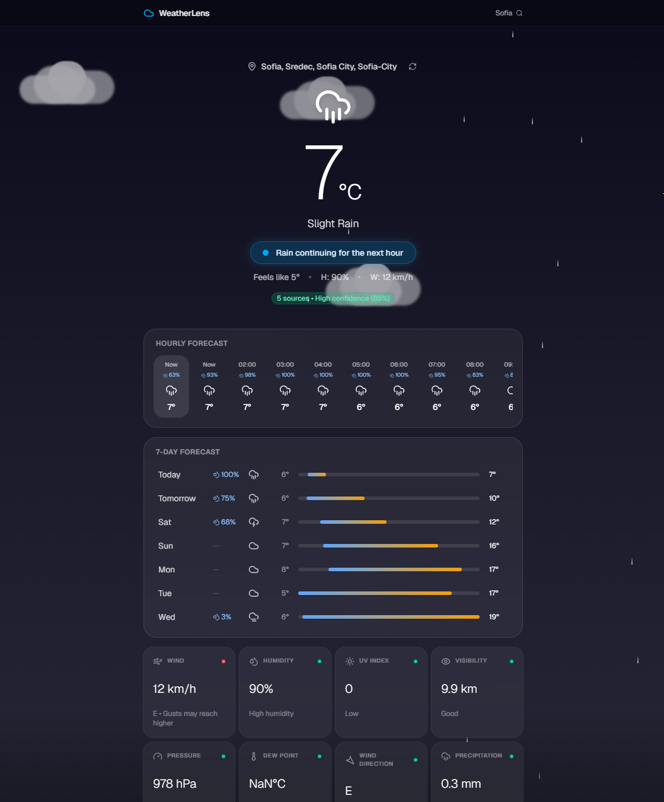
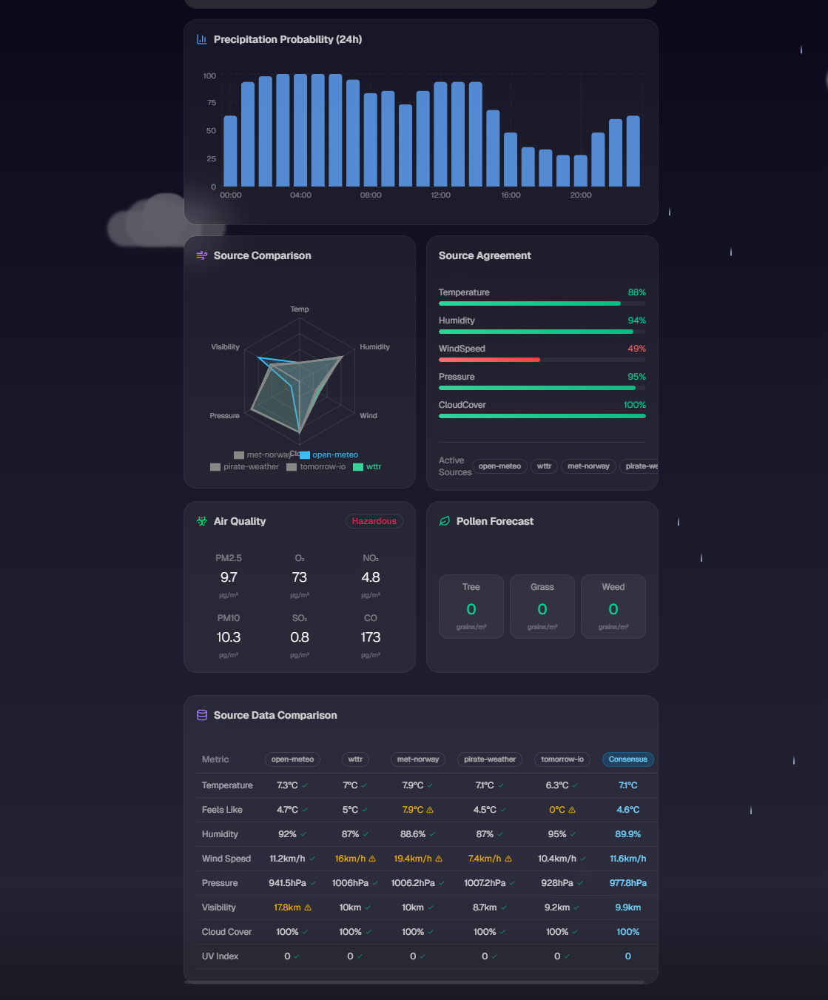

<div align="center">
  
  <h1>WeatherLens</h1>
  <p><strong>The Ultimate Multi-Source Weather Consensus Engine</strong></p>
  <p>
    🌐 <a href="https://weatherlens.space">weatherlens.space</a>
  </p>
  <p>
    React 19 • Vite 6 • Tailwind CSS v4 • Framer Motion
  </p>
</div>

***

**WeatherLens** is not just another weather app. It is a high-performance **Consensus Engine** that simultaneously aggregates real-time data from **8 globally recognized weather platforms**, strictly filters out inaccurate models, and outputs a hyper-accurate "consensus" forecast.

If one weather model predicts rain but the others predict sunshine, WeatherLens mathematically isolates the outlier and gives you the objective truth.

## 🌟 Key Features

*   **8-Source Aggregation**: Pulls parallel data from Open-Meteo, Tomorrow.io, Pirate Weather, ECMWF (MET Norway), OpenWeatherMap, Visual Crossing, WeatherAPI, and wttr.in.
*   **Median-Based Outlier Detection**: Dynamically calculates standard deviations across all APIs to filter out bizarre or broken data spikes.
*   **Interactive Live Radar Engine**: A high-performance, pre-loading radar playback map powered by RainViewer, tracking storm cells globally with Netflix-style smooth interpolation.
*   **Climate Time Machine**: Delves into Open-Meteo's Archive API to directly compare today's live temperature with precise historical data from exactly 1, 5, and 10 years ago.
*   **Astrophysics Dashboard**: Tracks real-time lunar phases, precise sunrise/sunset timing, and celestial illumination via the wttr.in API.
*   **Dynamic Day/Night 3D Iconography**: The app logo and browser favicon physically morph in real-time between 28 dynamically generated, geometric 3D SVG states matching the live cloud cover, precipitation, and day/night cycle.
*   **Address-Level Precision**: Utilizes OpenStreetMap Nominatim, allowing you to search specific street addresses, zip codes, or landmarks.
*   **Immersive Glassmorphic UI**: Powered by Tailwind CSS v4 and Framer Motion, featuring dynamic backgrounds that react to the current weather condition within a highly responsive intelligence grid.

<br>

<div align="center">
  <!-- TODO: Drop your app screenshots here! -->
  
  
</div>

<br>

## 🚀 Getting Started

WeatherLens is built around "graceful degradation." It will work beautifully **out-of-the-box using the 100% free APIs** (Open-Meteo, wttr.in, MET Norway).

To unlock the massive hyper-local and nowcasting engine, you can sign up for the free developer tiers of the remaining premium platforms and inject them into your environment.

### Installation

1. **Clone the repository:**
   ```bash
   git clone https://github.com/mdd1-V/weather-lens.git
   cd weather-lens
   ```

2. **Install dependencies:**
   ```bash
   npm install
   ```

3. **Configure the Environment:**
   Copy the `.env.example` file to create an active `.env` file:
   ```bash
   cp .env.example .env
   ```
   *(Optional)* Populate your `.env` with your free developer API keys from Tomorrow.io, OpenWeatherMap, etc., to drastically power-up the consensus accuracy.

4. **Boot the Engine:**
   ```bash
   npm run dev
   ```
   *Navigate to `http://localhost:5173` to view the app!*

## 🧠 How the Consensus Algorithm Works

WeatherLens executes all fetch calls via a `Promise.allSettled` block to ensure a slow or down API never breaks your app.

1. **Extraction**: The engine extracts exact parameters (Temperature, Wind Speed, UV, etc.) from all successful API hits.
2. **Median Sort**: It calculates the mathematical median of the pool.
3. **Thresholding**: It calculates a 20% deviation threshold. Any API returning a value outside this threshold is tagged as an `isOutlier`.
4. **Weighted Vote**: Outliers are mathematically punished, their weight reduced to `0.2`. The final resulting number is broadcast visually as the overarching "Consensus".

## 🛡️ License

Built with extreme passion. Free to fork, modify, and expand!
